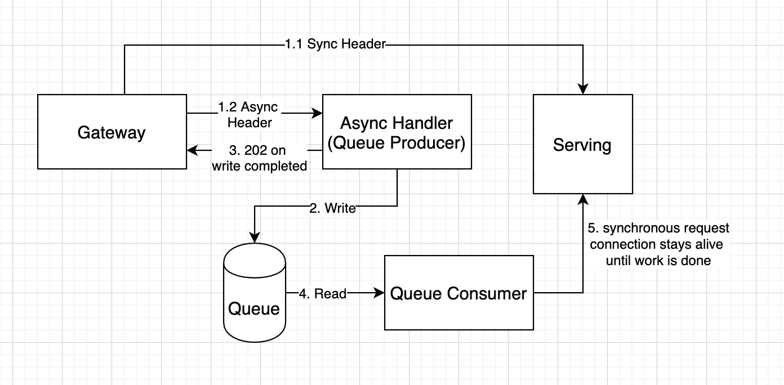

# Knative Asynchronous Component

Asynchronous component to enable asynchronous knative service calls.



## Install Knative Serving & Eventing to your Cluster

1. https://knative.dev/docs/install/any-kubernetes-cluster/

## Create your Demo Application.

## Create your Demo Application. 

1. This can be any simple hello world application that sleeps for some time. There is a sample application that sleeps for 10 seconds in the `test/app` folder. To deploy, use the `kubectl apply` command.
    
    ```
    kubectl apply -f test/app/service.yml
    ```

1. Make note of your application URL.

## Install the Consumer and Producer

1. Apply the following config files:

    ```
    ko apply -f config/async/100-async-consumer.yaml
    ko apply -f config/async/100-async-producer.yaml
    ```

## Install the Redis Source

1. Follow the `Getting Started` Instructions for the [Redis Source](https://github.com/lionelvillard/eventing-redis/tree/master/source)

1. For the `Example` section, do not install the entire `samples` folder, as you don't need the event-display sink. Only install redis with: `kubectl apply -f samples/redis`.

2. There is a .yaml file in the `async-component` describing the `RedisStreamSource`. It points to the `async-consumer` as the sink. You can apply this file now.
  ```
  kubectl apply -f config/async/100-async-redis-source.yaml
  ```

## Modify /etc/hosts to simulate a DNS forward or gateway forward:
1. Make note of your Kubernetes service external IP.
    ```
    kubectl get service producer-service
    ```

1. For now, modify /etc/hosts to point traffic from your application (something like helloworld-sleep.default.11.112.113.14) to your Kubernetes service IP (something like 11.111.111.11)
    ```
    11.111.111.11   helloworld-sleep.default.11.112.113.14.xip.io
    ```

## Test your Application
1. Curl your application. Try async & non async.

    ```
    curl helloworld-sleep.default.11.112.113.14.xip.io
    curl helloworld-sleep.default.11.112.113.14.xip.io -H "Prefer: respond-async" -v
    ```
