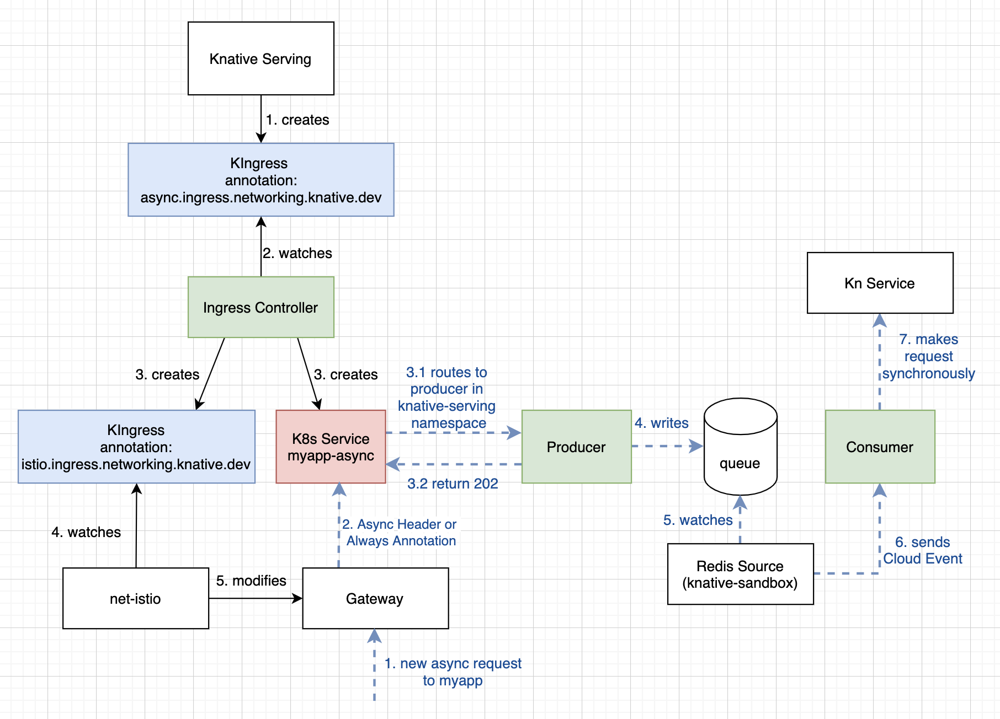

# Knative Asynchronous Component

>Warning: Experimental and still under development. Not meant for production deployment.
>Note: This component is currently only functional with Istio as the networking layer.

This is an add-on component that, when installed, will enable your Knative services to be called asynchronously. You can set a service to be always or conditionally asynchronous. Conditionally asynchronous services will respond when the `Prefer: respond-async` header is provided as a part of the request, while always asynchronous services do not need a special header to be called asynchronously.

## Architecture



When Knative Serving creates a service, one of the artifacts created is a KIngress for the service. The yaml for the KIngress will contain an annotation which is read by the networking controller (net-istio, net-countour, etc.). The ingress controller in our asynchronous component looks for KIngresses with the `async.ingress.networking.knative.dev` annotation. The ingress controller will then create a KIngress for Istio (annotated with `istio.ingress.networking.knative.dev`), which will be picked up by the net component (net-istio in the above case) to create the required istio components, such as a virtual service, to route asynchronous service calls appropriately. If the service is an always asynchronous service, then all requests are routed to the producer component.

The following is the request flow (seen in blue in the architecture diagram above)
1. A new request is made to the application url with the header `Prefer: respond-async`.
1. The gateway has been modified such that requests with this header are routed to a K8s service in the user namespace.
1. This K8s service routes the request to the producer component in the knative-serving namespace, while the producer component returns a `202 Accepted` status to the user.
1. The Producer is responsible for writing to the queue.
1. The Redis Source component watches the queue for new requests.
1. The Redis Source component sends cloud events to our Consumer service
1. The consumer component reads the cloud event and synchronously makes the service call to the Knative Service.

## Prerequisites
- A kubernetes environment, recommended version and sizing [here](https://knative.dev/docs/install/knative-with-operators/#prerequisites)
- Install [ko](https://github.com/google/ko)

## Install Knative Serving & Eventing to your cluster

1. https://knative.dev/docs/install/any-kubernetes-cluster/

## Install the consumer and async controller components

1. Apply the following config files:
    ```
    ko apply -f config/async/100-async-consumer.yaml
    ko apply -f config/ingress/controller.yaml
    ```

## Install the Redis source

### Using a cloud based Redis instance
1. Follow the `Getting Started - Install` Instructions for the [Redis Source](https://github.com/knative-sandbox/eventing-redis/tree/main/source#install).

1. Update the [producer .yaml file](config/async/100-async-producer.yaml) with the value for the `REDIS_ADDRESS`.

1. Update the [tls-secret.yaml file](config/async/tls-secret.yaml) with the cert.pem data key from your cloud instance. This will be the same key used in `Getting Started - Install` instructions. You can then apply it to your cluster.
    ```
    kubectl apply -f config/async/tls-secret.yaml
    ```

1. There is a [.yaml file](config/async/100-async-redis-source.yaml) in the `async-component` describing the `RedisStreamSource`. It points to the `async-consumer` as the sink. First, update the `address` value in this .yaml file. You can then apply it to your cluster.
    ```
    kubectl apply -f config/async/100-async-redis-source.yaml
    ```

### For a local installation of Redis
1. Follow the `Getting Started` Instructions for the
   [Redis Source](https://github.com/knative-sandbox/eventing-redis/tree/master/source). For the `Example` section, do not install the entire `samples` folder, as you
   don't need the event-display sink. Only install redis with:
   `kubectl apply -f samples/redis`.

1. Update the [producer .yaml file](config/async/100-async-producer.yaml) with the value for the `REDIS_ADDRESS`. This should be `redis.redis.svc.cluster.local:6379`.

1. There is a [.yaml file](config/async/100-async-redis-source.yaml) in the `async-component` describing the `RedisStreamSource`. It points to the `async-consumer` as the sink. First update the address to `rediss://redis.redis.svc.cluster.local:6379`. You can then apply it to your cluster.
    ```
    kubectl apply -f config/async/100-async-redis-source.yaml
    ```

## Install the producer component.

1. Apply the producer config file to install the component:
    ```
    ko apply -f config/async/100-async-producer.yaml
    ```

## Create your demo application

1. This can be any simple hello world application. There is a sample application that sleeps for 10 seconds in the [`test/app`](test/app) folder. To deploy, use the `kubectl apply` command:
    ```
    kubectl apply -f test/app/service.yml
    ```

    Alternatively you can deploy using a ko compiled image:
    ```
    ko apply -f test/app/koService.yaml  
    ```

1. Note that your application has an annotation setting the `ingress.class` as `async.ingress.networking.knative.dev`. This enables just this application to respond to the `Prefer: respond-async` header.
    ```
    networking.knative.dev/ingress.class: async.ingress.networking.knative.dev
    ```

1. Make note of your application URL, which you can get with the following command:
    ```
    kubectl get kservice helloworld-sleep
    ```

    Note: If you don't see the service make sure you are using the default namespace

1. (Optional) If you wanted every service created by knative to respond to the `Prefer: respond-async` header, you can configure Knative Serving to use the async ingress class for every service.

    ```
    kubectl patch configmap/config-network \
    -n knative-serving \
    --type merge \
    -p '{"data":{"ingress.class":"async.ingress.networking.knative.dev"}}'
    ```

    You can remove this setting by updating the ingress.class to null or by updating the ingress.class to the ingress.class you would like to use, for example `kourier`.
    ```
    kubectl patch configmap/config-network \
    -n knative-serving --type merge \
    -p '{"data":{"ingress.class":null}}'
    ```

    ```
    kubectl patch configmap/config-network \
    -n knative-serving \
    --type merge \
    -p '{"data":{"ingress.class":"kourier.ingress.networking.knative.dev"}}'
    ```

## Test your application
1. Curl your application. Try both asynchronous and non asynchronous requests.
    ```
    curl helloworld-sleep.default.11.112.113.14.xip.io
    curl helloworld-sleep.default.11.112.113.14.xip.io -H "Prefer: respond-async" -v
    ```

1. For the synchronous case, you should see that the connection remains open to the client, and does not close until about 10 seconds have passed, which is the amount of time this application sleeps. For the asynchronous case, you should see a `202` response returned immediately.

## Update your Knative service to be always asynchronous.
1. To set a service to always respond asynchronously, rather than conditionally requiring the header, you can add the following annotation in the `.yml` for the service.
    ```
    async.knative.dev/mode: always.async.knative.dev
    ```

1. You can find an example of this (commented) in the [`test/app/service.yml`](test/app/service.yml) file. Uncomment the annotation `async.knative.dev/mode: always.async.knative.dev`.

1. Update the application by applying the `.yaml` file:
    ```
    kubectl apply -f test/app/service.yml
    ```

## Test your application
1. Curl the application, this time without the `Prefer: respond-async` header. You should see a `202` response returned while some pods are spun up to handle your request.
    ```
    curl helloworld-sleep.default.11.112.113.14.xip.io -v
    ```

1. You can see the pods with `kubectl get pods.`

## Uninstalling the component
1. Remove the demo application
    ```
    kubectl delete -f test/app/service.yml
    ```
    You can verify deletion by checking the output of:
    ```
    kubectl get all --namespace=default | grep helloworld-sleep
    ```
1. If you previously set every service to respond to the `Prefer: respond-async` header, remember to remove this setting by updating `ingress.class` to null, the previous value, or by updating `ingress.class` to the `ingress.class` you would like to use, for example `kourier`.
    ```
    kubectl patch configmap/config-network \
    -n knative-serving --type merge \
    -p '{"data":{"ingress.class":null}}'
    ```

    ```
    kubectl patch configmap/config-network \
    -n knative-serving \
    --type merge \
    -p '{"data":{"ingress.class":"kourier.ingress.networking.knative.dev"}}'
    ```
1. Remove the producer component
    ```
    ko delete -f config/async/100-async-producer.yaml
    ```
    You can verify the deletion by checking the output of:
    ```
    kubectl get all --namespace=knative-serving | grep async-producer
    ```
1. Remove the `RedisStreamSource` and tls secret
    ```
    kubectl delete -f config/async/100-async-redis-source.yaml
    kubectl delete -f config/async/tls-secret.yaml
    ```
    You can verify deletion by checking the output of:
    ```
    kubectl get all --namespace=knative-serving | grep redis
    kubectl get secrets --namespace=knative-serving | grep tls
    ```
1. Remove the eventing-redis component - make sure you are using this command in the `eventing-redis` project
    ```
    ko delete -f source/config
    ```
    You can verify the deletion by checking the output of:
    ```
    kubectl get all --all-namespaces | grep redis
    ```
1. Remove the consumer and async controller components - back in the async component project.
    ```
    ko delete -f config/ingress/controller.yaml
    ko delete -f config/async/100-async-consumer.yaml
    ```
    You can verify deletion by checking the output of:
    ```
    kubectl get all --namespace=knative-serving | grep async-controller
    kubectl get all --namespace=knative-serving | grep async-consumer
    ```


