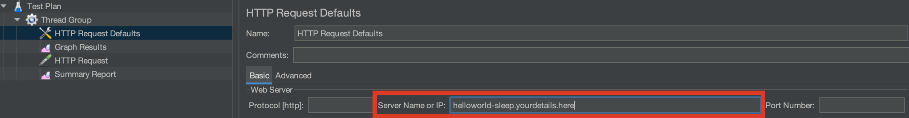
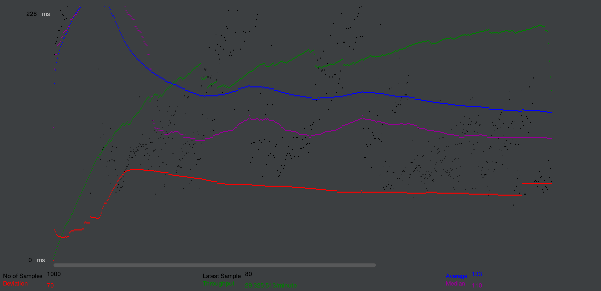
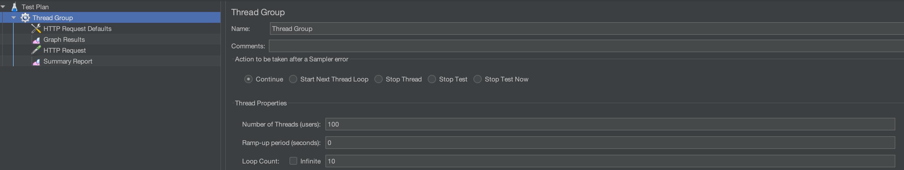
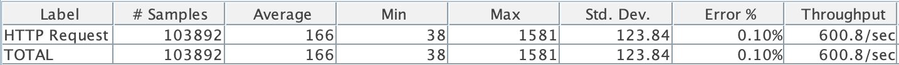
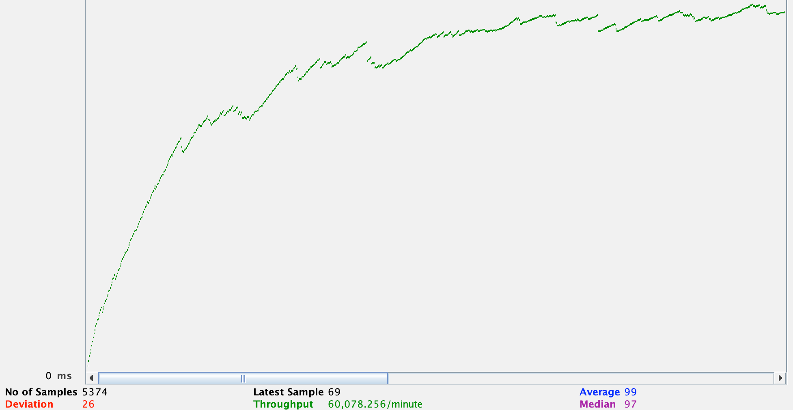

##Stress Test Guide:

Stress testing on the ingress can be performed using [JMeter](https://jmeter.apache.org/download_jmeter.cgi) (Version 5.4.1 at
time of initial testing).
Initial testing can be performed in GUI mode, however if pushing the performance limits it can be run from CLI as well.

**To run via GUI**

In order to stress test open the [PerformanceTest.jmx](./PerformanceTest.jmx) file with JMeter and edit these properties:
- In HTTP Request Defaults, edit `Server Name or IP` field to point to your helloworld application. 
  
Recall that you can find this ip by using `kubectl get kservice helloworld-sleep` as seen in the main README.
  
Note: If you don't see the service make sure you are using the default namespace

```
kubectl get kservice helloworld-sleep
NAME               URL                                                       LATESTCREATED         LATESTREADY           READY   REASON
helloworld-sleep   http://helloworld-sleep.default.111.11.111.111.sslip.io   helloworld-sleep-v1   helloworld-sleep-v1   True    
```


  

- You may also wish to edit the Graph Results and Summary Report output paths.



After editing these fields, simply run the test plan.  

The given test plan will spin up 100 threads with 10 loops of GET requests to the helloworld application and log the outcome.
The number of threads and loop count can be edited in the top level thread group area of the test plan or editing the JMX file.



**To run via command line:**
```
jmeter -n -t /path/to/async-component/test/JMeter/PerformanceTest.jmx -l /path/to/results.jtl   
```
The output file will contain the raw data.  Graphs and Summary can be viewed via JMeter GUI by simply opening the 
resultant JTL file in either the Graph Results or Summary Report within the test plan thread group.    

##Replicable Results

**Ingest Measurement**

Test cluster configuration - single node, 4 core, 16 GB memory kubernetes setup.

Long running initial ingest was similar to initial findings, but interestingly throughput increases for quite some time
during large sustained traffic loads.



For comparison, here is a short burst of ingest activity on a cold start


**Sink Measurement**

Initial determination at the sink was done by measuring the rate of acknowledged messages over
a one minute span while the above input pressure was applied as extracted from the redis-source logs.

`5700 messages/min` or `95 messages/sec` was the measured acknowledged message throughput in redis-source,
pointing to this as the current bottleneck by one order of magnitude. In this testing scenario the redis-source
deployment did not seem to scale out, while the async producer and consumer both created multiple pods horizontally.